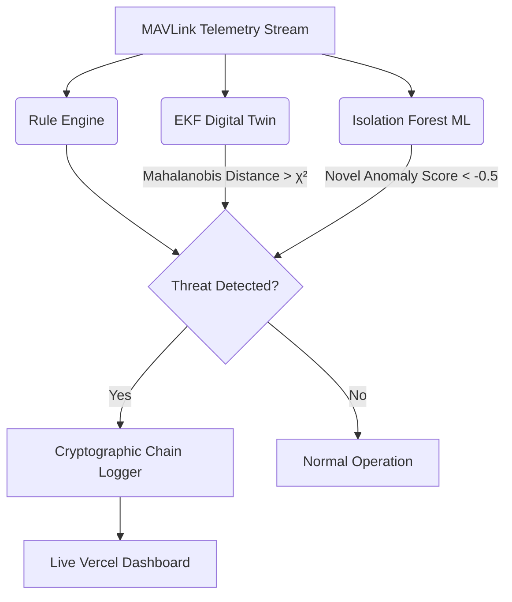

<div align="center">
  <h1>🛡️ AEGIS: Cyber-Physical Digital Twin IDS</h1>
  <p><b>Autonomous Embedded Guardian for Intrusion in Swarms</b></p>
  <p><i>A novel Kinematic EKF and Federated Isolation Forest approach to MAVLink anomaly detection.</i></p>
  <p><b>Team: Persistent Formation</b></p>
  
  [](https://opensource.org/licenses/MIT)
  []()
  []()
</div>

---

## 📌 Abstract

As UAV systems scale into critical infrastructure domains, the reliance on unencrypted protocols (e.g., MAVLink) introduces severe cyber-physical vulnerabilities. **AEGIS** is a novel Intrusion Detection System (IDS) explicitly engineered for resource-constrained companion computers. 

Moving beyond traditional static rule-based systems, AEGIS implements a **Cyber-Physical Digital Twin** powered by an **Extended Kalman Filter (EKF)**. By tracking the UAV's 6-DOF kinematics in real-time, AEGIS computes the Mahalanobis distance of sensor innovations to mathematically detect **NavIC/GPS Spoofing** and sensor hijacking. Complex protocol-level anomalies are handled by a lightweight **Isolation Forest** machine learning model.

This architecture aligns strictly with the latest research in aerospace Guidance, Navigation, and Control (GNC) and Critical Infrastructure Cyber-Security.

---

## 🔬 Core Architecture: The EKF Digital Twin

Traditional IDS solutions struggle to differentiate between erratic high-dynamic flight and malicious sensor spoofing. AEGIS solves this using an internal physics model.

The state vector is defined as $X = [x, y, z, v_x, v_y, v_z]^T$.
At each timestep, the EKF predicts the expected spatial coordinates. When a MAVLink `GLOBAL_POSITION_INT` packet arrives, AEGIS computes the measurement residual (innovation) $y = z - H\hat{x}$ and the innovation covariance $S = H P H^T + R$.

If the **Mahalanobis distance** exceeds the $\chi^2$ confidence threshold (99.9% / 16.27):
$$ d^2 = y^T S^{-1} y > \chi^2_{0.999} $$
The system definitively flags the packet as a NavIC/GPS spoofing attempt, recognizing that the UAV has physically violated the laws of motion.



## 🔒 Forensic Integrity (Chain-of-Custody)

In compliance with cyber-forensic requirements, AEGIS implements a tamper-evident **Cryptographic Chain Logger**. Every single alert and packet is serialized to JSON and hashed using SHA-256. The hash of entry $N-1$ is mathematically linked into entry $N$.

If an attacker breaches the companion computer and alters historical logs to hide their intrusion, the cryptographic chain breaks, making the tampering instantly provable during post-incident forensic analysis.

## 🚀 Installation & Simulation

```bash
# 1. Clone repository
git clone https://github.com/sumitsaraswat362/Drone-IDS-AEGIS.git
cd Drone-IDS-AEGIS

# 2. Create virtual environment
python3 -m venv venv
source venv/bin/activate
pip install --upgrade pip setuptools
pip install -r requirements.txt

# 3. Run a deterministic attack scenario
python3 main.py --scenario scenarios/gps_spoofing.yaml
```

### Attack Vectors Tested & Validated:
1. **NavIC/GPS Spoofing (detected via EKF Digital Twin)**
2. **Command Injection / Impersonation (detected via Rule Engine)**
3. **Denial-of-Service / Heartbeat Flood (detected via Rule Engine)**
4. **Replay Attacks (detected via timestamp monotonicity)**

## 📊 Vercel Real-time Dashboard

AEGIS includes a fully functioning Next.js Real-time Dashboard that acts as a GCS (Ground Control Station) threat visualizer.

```bash
cd dashboard
npm install
npm run dev
```
Navigate to `http://localhost:3000` to view the live threat map.

---
*Developed for the PUSHPAK Grand Challenge 2026: Security of Drones.*
